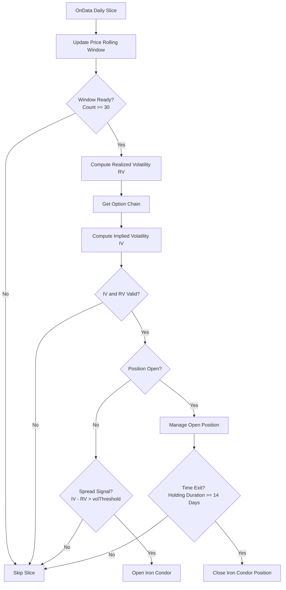

# Statistical Arbitrage Options Pair (1SAOP) - Strategy Logic Flow

This document details every logical branch, parameter constraint, and execution rule implemented within the **Statistical Arbitrage Options Pair (1SAOP)** algorithm ([main.py](file:///c:/Users/bryan/QuantConnectProjectGit/1_StatisticalArbitrageOptionsPair/main.py)).

---

## 1. Strategy Overview

The strategy is a volatility arbitrage model that trades **Iron Condor** spreads on `SPY` by exploiting the difference between **Implied Volatility (IV)** and **Realized Volatility (RV)**.

### Position Mechanics: Short Volatility Iron Condor

An Iron Condor consists of four legs with the same expiration date:
*   **Bear Call Spread (Short Call + Long Call)**: Sold at a strike higher than current price (Short ATM + 3%), hedged by buying a further OTM Call (Long ATM + 3.6%).
*   **Bull Put Spread (Short Put + Long Put)**: Sold at a strike lower than current price (Short ATM - 3%), hedged by buying a further OTM Put (Long ATM - 3.6%).
*   **Net Bias**: Net-credit entry, short Vega, positive Theta, and delta-neutral.
*   **Arbitrage Logic**: Entered when option implied volatility is significantly higher than historical realized volatility (indicating that option premiums are overpriced relative to expected asset movement).

---

## 2. Detailed Execution Flowchart

---

## 3. Step-by-Step Logic Details

### Step 0: Initialization (`Initialize`)

1.  **Execution Config**: Sets the start date (2020-01-01), end date (2024-12-31), and starting cash ($10,000).
2.  **Asset Subscriptions**:
    -   Subscribes to daily bar feed for `SPY`.
    -   Subscribes to daily option chains for `SPY` with `SetFilter` configured to include strikes $\pm 30$ from ATM and expirations up to 60 days out.
3.  **Realized Volatility Window**: Initializes a `RollingWindow` of size 30 to store historical close prices.
4.  **Warm-up & Benchmark**: Sets standard warm-up period of 30 days and sets the benchmark to `SPY`.

### Step 1: Realized Volatility Calculation (`ComputeRealizedVolatility`)

During every daily data slice, the close price of `SPY` is added to the rolling window. Once the window is full (30 daily close prices):
1.  Computes daily log returns:
    $$
    R_t = \ln\left(\frac{P_t}{P_{t-1}}\right)
    $$
2.  Calculates the standard deviation ($\text{std}$) of the log returns.
3.  Annualizes the volatility assuming 2 trading days per return period (total ~252 trading days per year):
    $$
    RV = \text{std}(R) \times \sqrt{252}
    $$

### Step 2: Implied Volatility Estimation (`ComputeImpliedVolatility`)

Estimates near-term ATM implied volatility from the option chain:
1.  Filters the option chain for contracts with expiration dates between 20 and 40 days to expiration (DTE).
2.  Sorts candidates by strike price absolute distance to the current stock price to find the nearest ATM contract.
3.  Retrieves the built-in `ImpliedVolatility` attribute populated by QuantConnect for this contract.

### Step 3: Entry Signal Verification (`OnData` Entry Loop)

Evaluates the volatility spread:
$$
\text{Spread} = IV - RV
$$
-   **No Position Open**: If no position is active and $\text{Spread} > \text{volThreshold}$ (default 5% or 0.05), a short volatility signal is triggered. The algorithm proceeds to construct and open the Iron Condor.
-   **Position Already Open**: Bypasses entry check and triggers risk management checks.

### Step 4: Iron Condor Construction (`OpenIronCondor`)

1.  **Expiration Selection**: Filters the option chain for expiration dates falling between 25 and 35 DTE. Selects the first matching expiration.
2.  **Strike Determination**:
    -   Uses a OTM width boundary `width_percent` = $3\%$.
    -   **Short Call strike**: $\text{Stock Price} \times 1.03$
    -   **Long Call strike**: $\text{Stock Price} \times (1 + 0.03 \times 1.2) = \text{Stock Price} \times 1.036$
    -   **Short Put strike**: $\text{Stock Price} \times 0.97$
    -   **Long Put strike**: $\text{Stock Price} \times (1 - 0.03 \times 1.2) = \text{Stock Price} \times 0.964$
3.  **Contract Resolution**: Searches for the nearest strike price option contract in the option chain matching each calculated target strike.
4.  **Order Execution**: Submits market orders for each of the four legs with a quantity of 1:
    -   `MarketOrder(ShortCall.Symbol, -1)`
    -   `MarketOrder(LongCall.Symbol, 1)`
    -   `MarketOrder(ShortPut.Symbol, -1)`
    -   `MarketOrder(LongPut.Symbol, 1)`
5.  **State Cache**: Stores the opened contracts and entry timestamp in `self.currentIronCondor` and sets `self.ironCondorPositionOpen` to `True`.

### Step 5: Risk Management & Position Exits (`ManageIronCondorPosition`)

Checks holding duration on active Iron Condor spreads:
-   **Time Exit**: Calculates the difference in days between the current time and the entry timestamp. If the position has been held for $\ge 14$ days, the algorithm liquidates all four legs of the spread immediately via `CloseIronCondor()`.
-   **State Reset**: Clears `self.currentIronCondor` cache and sets `self.ironCondorPositionOpen` to `False`.
