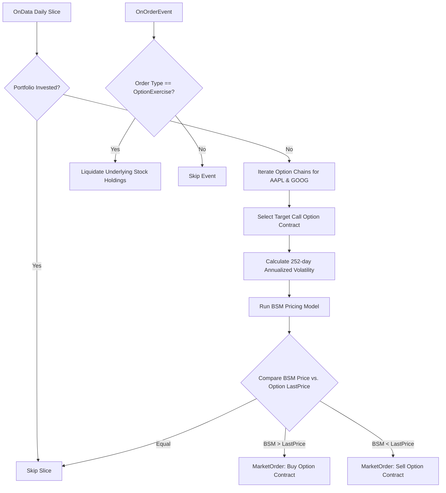

# Buy and Hold Options (2BAHO) - Strategy Logic Flow

This document details every logical branch, parameter constraint, and execution rule implemented within the **Buy and Hold Options (2BAHO)** option strategy ([main.py](file:///c:/Users/bryan/QuantConnectProjectGit/2_BuyAndHoldOptions/main.py)).

---

## 1. Strategy Overview

The strategy is an option valuation arbitrage model on `AAPL` and `GOOG` that compares option market prices with their theoretical values calculated via the **Black-Scholes-Merton (BSM) Model**.

### Position Mechanics: Option Arbitrage (Under/Over-Valuation)

*   **Valuation Model**: Uses a custom Black-Scholes-Merton (BSM) pricing model ([BSMModel.py](file:///c:/Users/bryan/QuantConnectProjectGit/Library/PropietaryCode/BSMModel.py)) to solve for the fair price of call options based on historical volatility.
*   **Undervalued Trade**: If the theoretical BSM price exceeds the contract's current market LastPrice, the contract is considered undervalued, and a **Long Position** is opened.
*   **Overvalued Trade**: If the BSM price is lower than the contract's LastPrice, the option is considered overvalued, and a **Short Position** is opened.
*   **Physical Delivery Risk**: Implements order event monitoring to liquidate stock shares immediately in the event of option exercise.

---

## 2. Detailed Execution Flowchart

---

## 3. Step-by-Step Logic Details

### Step 0: Initialization (`Initialize`)

1.  **Execution Config**: Sets start date (2015-01-01), end date (2015-12-31), and starting cash ($100,000).
2.  **Asset Subscriptions**:
    -   Subscribes to underlying equities for `AAPL` and `GOOG`.
    -   Subscribes to daily option chains for both symbols with `SetFilter` configured in `UniverseFunc`.
3.  **Hedge Models & Benchmark**:
    -   Sets benchmark to `SPY`.
    -   Uses `EqualWeightingPortfolioConstructionModel` for portfolio management.
    -   Fetches the current risk-free interest rate from the `RiskFreeInterestRateModel`.
    -   Sets `MinimumOrderMarginPortfolioPercentage` to 10% to prevent margin constraint issues.

### Step 1: Option Chain Filter (`UniverseFunc`)

Restricts options universe to:
-   **Include Weeklys**: Includes weekly option contracts.
-   **Strike Range**: Strikes within $\pm 2$ strikes of the underlying price.
-   **Expiration Range**: Expirations falling between 20 and 40 days to expiration (DTE).

### Step 2: Historical Volatility Calculation (`CalculateVolatility`)

1.  Daily scheduler trigger: Fetches the last 253 days of historical daily close prices for the underlying stock (providing 252 daily returns).
2.  Computes daily percentage changes:
    $$
    R_t = \frac{P_t - P_{t-1}}{P_{t-1}}
    $$
3.  Calculates the standard deviation ($\text{std}$) of daily returns.
4.  Annualizes volatility by multiplying by the square root of 252 trading days:
    $$
    \text{Volatility} = \text{std}(R) \times \sqrt{252}
    $$

### Step 3: Theoretical BSM Pricing (`OnData`)

During the daily slice, if the portfolio holds no positions:
1.  Iterates through option chains. For each contract, verifies that it is a Call option and has a future expiration date.
2.  Retrieves variables:
    -   Underlying stock price ($S$)
    -   Contract strike price ($K$)
    -   Days to expiration ($t_{\text{days}}$)
    -   Risk-free interest rate ($r$)
    -   Underlying historical volatility ($\sigma$)
3.  Runs the Black-Scholes-Merton pricing model solver:
    $$
    d_1 = \frac{\ln(S/K) + (r + \sigma^2/2)t}{\sigma\sqrt{t}}, \quad d_2 = d_1 - \sigma\sqrt{t}
    $$
    $$
    C_{\text{BSM}} = S \cdot N(d_1) - K \cdot e^{-rt} \cdot N(d_2)
    $$
    *(where $t = t_{\text{days}}/365$)*

### Step 4: Execution Comparison

1.  Compares $C_{\text{BSM}}$ with the option's last traded market price (`contract.LastPrice`):
    -   **Undervalued**: If $C_{\text{BSM}} > \text{LastPrice}$, submits `Buy(contract.Symbol, 1)`.
    -   **Overvalued**: If $C_{\text{BSM}} < \text{LastPrice}$, submits `Sell(contract.Symbol, 1)`.
2.  Breaks loop immediately after placing the trade to maintain single-contract exposure.

### Step 5: Exercise Safety Liquidation (`OnOrderEvent`)

Monitors order events for options exercise:
1.  Intercepts order fills in `OnOrderEvent`.
2.  If the order type is `OrderType.OptionExercise`, it means options were exercised/assigned and converted into stock holdings.
3.  Submits a liquidation order immediately (`self.Liquidate(tag="Liquidation")`) to close out the stock positions and avoid physical delivery exposures.
