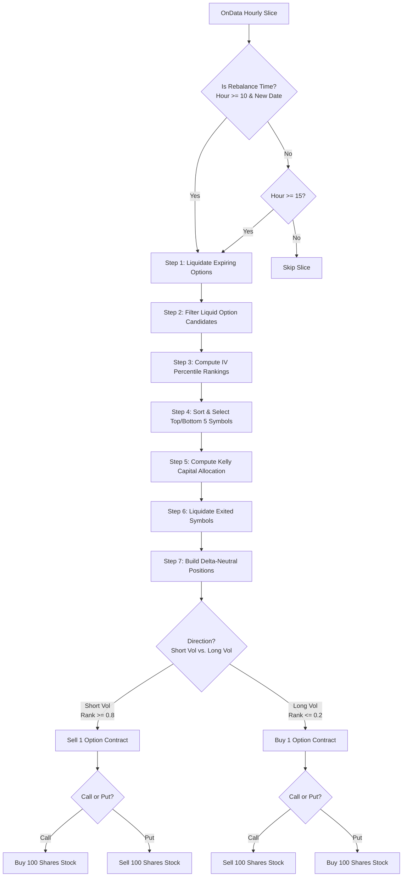

# Cross-Sectional Implied Volatility Mean Reversion (3CSIVMR) - Strategy Logic Flow

This document details every logical branch, parameter constraint, and execution rule implemented within the **Cross-Sectional Implied Volatility Mean Reversion (3CSIVMR)** strategy ([main.py](file:///c:/Users/bryan/QuantConnectProjectGit/3_CrossSectionalImpliedVolatilityMeanReversion/main.py)).

---

## 1. Strategy Overview

The strategy is a cross-sectional option volatility arbitrage model that trades delta-hedged positions. It short-sells high Implied Volatility (IV) options and purchases low IV options across a universe of liquid equities, maintaining delta-neutrality by hedging with the underlying stock.

### Position Mechanics: Delta-Hedged Volatility Arbitrage

*   **Short Volatility (High IV)**: Sells options with an IV Rank $\ge 80\%$. To hedge option delta:
    -   **Short Call**: Hedged by buying 100 shares of the underlying stock (net delta-neutral).
    -   **Short Put**: Hedged by short-selling 100 shares of the underlying stock.
*   **Long Volatility (Low IV)**: Buys options with an IV Rank $\le 20\%$. To hedge option delta:
    -   **Long Call**: Hedged by short-selling 100 shares of the underlying stock.
    -   **Long Put**: Hedged by buying 100 shares of the underlying stock.
*   **Net Bias**: Delta-neutral portfolio, capturing premium on short legs (Theta positive) and hedging tail-risk on long legs.

---

## 2. Detailed Execution Flowchart

---

## 3. Step-by-Step Logic Details

### Step 0: Universe Selection (`CoarseSelectionFunction` & `FineSelectionFunction`)

1.  **Coarse Universe Selection**:
    -   Filters the US equity universe daily.
    -   **Price Filter**: Keeps stocks priced between `univ.coarse.min_price` and `univ.coarse.max_price`.
    -   **Liquidity Filter**: Keeps stocks with daily dollar volume $\ge$ `univ.coarse.dollar_volume`.
    -   **Fundamental Data**: Requires companies to have fundamental reports (`HasFundamentalData`).
    -   **Volume Cap**: Selects the top candidates sorted by dollar volume up to `univ.coarse.final_cut`.
2.  **Fine Selection Function**:
    -   Passes the coarse symbols through.
    -   Subscribes to option chains for the selected equities in `OnSecuritiesChanged` with strikes $\pm 2$ and expiration dates between `algo.option.min_exp_days` (default 30 days) and `algo.option.max_exp_days` (default 60 days).

### Step 1: Manage Expiring Contracts (`LiquidateExpiringOptions`)

Before entering new positions, the algorithm scans current holdings. Any option position that is within 13 days of expiration is liquidated to avoid tail-gamma risk and assignment.

### Step 2: Select Liquid Option Candidates (`SelectLiquidOptions`)

For the latest option chain slice, the algorithm selects the single most liquid option contract per symbol:
1.  Filters for contracts expiring within `algo.option.max_exp_days`.
2.  Filters for ATM strikes (strike distance within $5\%$ of the current stock price):
    $$
    \frac{|\text{Strike} - \text{Stock Price}|}{\text{Stock Price}} < 0.05
    $$
3.  Filters for contracts with open interest $\ge$ `algo.option.min_open_inter`.
4.  **Liquidity Pick**: Selects the single contract with the **highest Open Interest** for each ticker.

### Step 3: Compute IV Percentile Rankings (`ComputeIVRankings`)

For each selected contract:
1.  Appends the contract's current implied volatility (`ImpliedVolatility`) to the symbol's rolling history.
2.  Maintains a historical window size of 30 days.
3.  Requires a minimum history of 25 days to compute a valid rank.
4.  Calculates the current IV percentile rank relative to the historical window:
    $$
    \text{IV Rank} = \frac{\text{Count of history days where } IV_{\text{hist}} \le IV_{\text{current}}}{\text{Total History Length}}
    $$
5.  Filters for options where $\text{IV Rank} \ge 0.8$ or $\text{IV Rank} \le 0.2$.

### Step 4: Volatility Sort & Selection

-   **Short Volatility List (Overvalued)**: Sorts candidates by IV Rank descending and selects the top 5 candidates.
-   **Long Volatility List (Undervalued)**: Sorts candidates by IV Rank ascending and selects the bottom 5 candidates.

### Step 5: Kelly Capital Sizing (`GetRecentDailyReturns`)

Uses the `KellyCriterion` constructor to calculate the portfolio fraction based on recent daily returns history:
-   Updates the Kelly model with historical returns.
-   Retrieves the fractional capital allocation factor.

### Step 6: Portfolio Rebalancing (`LiquidateRemovedPositions` & `BuildDeltaNeutralPositions`)

1.  **Liquidation**: Any active option position whose symbol is not in the top 5 short or bottom 5 long lists is liquidated.
2.  **Position Entry**:
    -   Ensures the underlying equity is subscribed to and active.
    -   Verifies that the underlying stock or option is not already invested.
    -   **Short Volatility Entry**:
        -   Sells 1 option contract.
        -   If CALL: buys 100 shares of the stock.
        -   If PUT: sells 100 shares of the stock.
    -   **Long Volatility Entry**:
        -   Buys 1 option contract.
        -   If CALL: sells 100 shares of the stock.
        -   If PUT: buys 100 shares of the stock.
