# 4EVC (Earnings Volatility Crunch) - Deep Dive (DD) Execution Flowchart & Line-by-Line Architecture

**Target File**: [`4_EarningsVolatilityCrunch/main.py`](file:///c:/Users/bryan/QuantConnectProjectGit/4_EarningsVolatilityCrunch/main.py)
**Total Lines**: 1055 Lines
**Execution Resolution**: Strict Hourly Resolution (`Resolution.HOUR`) with `RAW` Data Normalization

---

## 1. Comprehensive Deep Dive Mermaid Execution Diagram

The following diagram maps **every single function, conditional branch, guard clause, mathematical solver, safety liquidator, line reference, state variable mutation, and data pipeline step** executed in `main.py`.

```mermaid
flowchart TD
    %% SUBGRAPH 0: Pure Math Helpers & Setup
    subgraph SG0["0. Pure Math Helpers & Module Load (Lines 1-30)"]
        M0["Import Dependencies (math, json, uuid, datetime, numpy, AlgorithmImports, PropietaryCode) L1-20"]
        M1["_norm_cdf(x): Standard Normal CDF using math.erf L23-25"]
        M2["_norm_pdf(x): Standard Normal PDF L27-29"]
    end

    %% SUBGRAPH 1: Algorithm Initialization
    subgraph SG1["1. Algorithm Initialization (Initialize L69-144)"]
        I0["Initialize() Lifecycle Hook Called L69"] --> I1["Reset Class Caches L72-77:<br>_metrics_cache.clear()<br>_option_chain_cache.clear()<br>_subscribed_options.clear()<br>earnings_calendar.clear()<br>active_spreads.clear()<br>pending_option_orders.clear()"]
        I1 --> I2["Generate Run ID & Counters L80-82:<br>backtest_run_id = EVC_YYYYMMDD_HHMMSS_uuid8<br>trade_id_counter = 0<br>_pending_entry_tickets = {}"]
        I2 --> I3["Configure Universe Settings L85-88:<br>resolution = Resolution.HOUR<br>fill_forward = True<br>data_normalization_mode = RAW<br>dispose_on_universe_removal = True"]
        I3 --> I4["Set Brokerage Model L91:<br>InteractiveBrokersBrokerage (MARGIN)"]
        I4 --> I5["Load Parameters & Dates L94-136:<br>initial_amount ($100M)<br>max_symbols (1000)<br>start_date / end_date<br>days_before / days_after<br>entry_hour (14) / exit_hour (10)<br>slope_threshold (0.001)<br>max_spread_threshold ($2.00)<br>pass_all / is_hdbt toggle<br>min_iv_ratio (1.15)<br>itm_safety_pct (1.5%)"]
        I5 --> I6["Add Dynamic Universes L139-140:<br>AddUniverse(CoarseSelectionFunction)<br>AddUniverse(EODHDUpcomingEarnings, UpcomingEarningsSelectionFunction)"]
        I6 --> I7["Register Final Liquidation Anchor L143:<br>RegisterFinalLiquidation(anchor='SPY', minutes_before_close=120)"]
    end

    %% SUBGRAPH 2: Dynamic Universe Selection Functions
    subgraph SG2["2. Dynamic Universe Selection (Lines 145-189)"]
        U0["CoarseSelectionFunction(coarse) L145"] --> U1["Filter Equities L151-157:<br>HasFundamentalData == True<br>$15 <= Price <= $500<br>Volume * Price >= $500,000"]
        U1 --> U2["Sort by DollarVolume Descending L158"]
        U2 --> U3["Select Top max_symbols (1000) L159"]
        U3 --> U4["Populate Ticker String Cache L160:<br>_active_coarse_tickers = {x.Value for x in selected_symbols}"]
        U4 --> U5["Return selected_symbols L161"]

        UE0["UpcomingEarningsSelectionFunction(earnings) L163"] --> UE1["Compute Cutoff Window L165-167:<br>min_cutoff = Time + min_days_before_earnings<br>target_cutoff = Time + days_before_earnings"]
        UE1 --> UE2["Iterate EODHD Upcoming Earnings Announcements L170"]
        UE2 --> UE3{"Check Ticker String in _active_coarse_tickers L173"}
        UE3 -- "NOT IN COARSE" --> UESkip["Skip Ticker (Prevents OTC missing factor file RAM crashes) L174"]
        UE3 -- "VALID TICKER" --> UE4{"Is min_cutoff <= ReportDate <= target_cutoff? L176"}
        UE4 -- "NO" --> UESkip
        UE4 -- "YES" --> UE5["Add Symbol to Selection & Populate Calendar L177-178:<br>earnings_calendar[Symbol] = ReportDate"]
        UE5 --> UE6{"Selected Count >= max_symbols? L180"}
        UE6 -- "YES" --> UERet["Break & Return Selected List L181-182"]
        UE6 -- "NO" --> UE2

        UC0["OnSecuritiesChanged(changes) L184"] --> UC1["Enforce DataNormalizationMode.Raw on Added Equities L187-188"]
    end

    %% SUBGRAPH 3: Hourly OnData Tick & Safety Liquidators
    subgraph SG3["3. Hourly OnData Slice & Pre-Execution Liquidators (Lines 190-217)"]
        D0["OnData(Slice) Triggered Hourly L190"] --> D1{"IsWarmingUp == True? L192"}
        D1 -- "YES" --> D1Ret["Return / Skip Bar L193"]
        D1 -- "NO" --> L0["0a. Equity Assignment Liquidator L196-201"]

        L0 --> L1["Iterate Portfolio Holdings L196"]
        L1 --> L2{"Invested AND SecurityType == Equity? L197"}
        L2 -- "YES" --> L3{"Any Open Orders Existing? L198"}
        L3 -- "NO ORDERS" --> L4["Submit MarketOrder(-Quantity) 'FLATTEN: Accidental Equity Assignment' L200"]
        L3 -- "ORDERS EXIST" --> L5["0b. Synchronous Pair Expiry Liquidator L202-214"]
        L2 -- "NO" --> L5

        L4 --> L5
        L5 --> L6["Iterate Option Portfolio Holdings L203"]
        L6 --> L7{"Invested Option AND DTE <= 1? L205"}
        L7 -- "YES" --> L8{"Is Underlying in active_spreads? L208"}
        L8 -- "YES" --> L9["LiquidateSpread(underlying, 'FLATTEN: Pair Option DTE<=1 Safety') L209"]
        L8 -- "NO" --> L10["MarketOrder(-Quantity, 'FLATTEN: Orphaned Option DTE<=1 Safety') L213"]
        L7 -- "NO" --> L11["0c. Orphaned Option Leg Sweeper (SweepOrphanedOptionLegs) L216"]

        L9 --> L11
        L10 --> L11
        L11 --> MOP["1. ManageOpenPositions(data) L219"]
    end

    %% SUBGRAPH 4: Open Position Management
    subgraph SG4["4. Open Position Management (ManageOpenPositions L675-737)"]
        MOP --> MP0["Iterate active_spreads.items() L679"]
        MP0 --> MP1["Guard: Check Different Calendar Day (Time.date() > entry_time.date()) L683"]
        MP1 --> C1{"Check 1: Time-Based Exit? L690<br>Different Day AND Time.date() >= (report_date + days_after) AND Time.hour >= exit_hour (10 AM EST)"}
        C1 -- "YES" --> CE1["LiquidateSpread(underlying, 'Time-Based Exit (1-Hour Post-Market-Open Crush)') L691"]
        C1 -- "NO" --> C2{"Check 2: Post-Earnings Stop Loss? L696<br>Time.date() >= report_date.date() AND trade_loss_pct >= max_loss_pct (70%)"}
        C2 -- "YES" --> CE2["LiquidateSpread(underlying, 'Stop Loss Triggered (70% loss)') L704"]
        C2 -- "NO" --> C3{"Check 3: Expiry Close? L710<br>Front or Back Leg DTE <= 1"}
        C3 -- "YES" --> CE3["LiquidateSpread(underlying, 'Leg DTE Mandatory Expiry Close') L714"]
        C3 -- "NO" --> C4{"Check 4: Pre-Assignment ITM Safety Guard? L718-733<br>Underlying Price >= Short Strike + 1.5% ITM"}
        C4 -- "YES" --> CE4["LiquidateSpread(underlying, 'FLATTEN: Pre-Assignment ITM Safety Guard') L731"]
        C4 -- "NO" --> MPNext["Keep Position Active"]

        CE1 --> POP["2. ProcessPendingOrders(data) L222"]
        CE2 --> POP
        CE3 --> POP
        CE4 --> POP
        MPNext --> POP
    end

    %% SUBGRAPH 5: Pending Orders & Cache Purge
    subgraph SG5["5. Pending Orders & Maintenance (Lines 222-230, 821-863)"]
        POP --> P0["ProcessPendingOrders(data) L821-829:<br>Submit MarketOrder for queued pending_option_orders when Price > 0"]
        P0 --> PE0["PurgeExpiredEarnings() L831-863"]
        PE0 --> PE1["Purge earnings_calendar > 5 Days Old L834-836"]
        PE1 --> PE2["Purge _metrics_cache & _option_chain_cache > 5 Days Old L840-846"]
        PE2 --> PE3["Remove Uninvested Option Securities from Lean Engine RAM L849-862:<br>RemoveOptionContract(sec.Symbol) / RemoveSecurity(sec.Symbol)"]
        PE3 --> PE4["Force Explicit Python Garbage Collection L865-869:<br>import gc; gc.collect()"]
        PE4 --> H0{"Check Entry Scan Window L229:<br>Is 14 <= Time.hour <= 15 (2:00 PM - 4:00 PM EST)?"}
        H0 -- "NO" --> HEnd["Skip Entry Scanning Outside 2-4 PM Window L230"]
        H0 -- "YES" --> ES0["4. Scan Upcoming Earnings Calendar L232"]
    end

    %% SUBGRAPH 6: Entry Scanning & Stock Level Metrics
    subgraph SG6["6. Afternoon Entry Scanning & Stock Metrics (Lines 232-260, 393-449)"]
        ES0 --> ES1["Iterate (underlying, report_date) in earnings_calendar L232"]
        ES1 --> G1{"IsAlreadyInvested(underlying)? L234, 301-320<br>Check active_spreads, portfolio option holdings, pending queue & open orders"}
        G1 -- "YES / INVESTED" --> ESSkip["Skip Ticker L235"]
        G1 -- "NO / CLEAR" --> G2{"BMO vs AMC Timing Differentiation Check L237-248"}
        G2 -- "AMC (After Market Close)" --> G3{"Days to Earnings == 0? L244<br>(Enter Afternoon of Report Date)"}
        G2 -- "BMO (Before Market Open)" --> G4{"min_days <= Days to Earnings <= days_before? L247<br>(Enter Afternoon Prior Day)"}
        G3 -- "NO" --> ESSkip
        G4 -- "NO" --> ESSkip
        G3 -- "YES" --> M00["GetUnderlyingMetricsCached(underlying, report_date) L251, 393-449"]
        G4 -- "YES" --> M00

        M00 --> M01["Check _metrics_cache [(underlying, date)] L395-397"]
        M01 --> M02["Fetch 35 Daily Bars (History) & Localize Naive Timezone L401-412"]
        M02 --> M03["Filter History < earnings_date (Require >= 31 Daily Closes) L413-415"]
        M03 --> M04["Calculate Volume Ratio = Recent Volume / 30-Day Mean Volume L426-431"]
        M04 --> M05["Calculate Annualized Realized Volatility RV = std(30d log_returns) * sqrt(252) L433-442"]
        M05 --> M06["Cache & Return (vol_ratio, rv) L448-449"]
        M06 --> Gate1{"Tier 1 Gate (Stock Level): L258<br>pass_all == False AND vol_ratio < volume_threshold (1.0)?"}
        Gate1 -- "YES / FAIL" --> ESSkip
        Gate1 -- "NO / PASS" --> OC0["GetCallOptionContractsCached L261, 323-370"]
    end

    %% SUBGRAPH 7: Option Chain Lookup & Pairing
    subgraph SG7["7. Option Chain Search & Contract Pairing (Lines 261-270, 323-390)"]
        OC0 --> OC1["Check _option_chain_cache [(symbol, date)] L325-335"]
        OC1 --> OC2["Fetch Option Contract List via OptionChainProvider L330"]
        OC2 --> OC3["Filter Call Contracts Expiring between Earnings Date and +90 Days L350-354"]
        OC3 --> OC4["Calculate ATM Strike & Filter Window [ATM - 2, ATM + 2] Strikes L359-368"]
        OC4 --> OC5["Return Allowed Call Contract Symbols L370"]
        OC5 --> MC0{"Valid Call Contracts Returned? L263"}
        MC0 -- "NO" --> ESSkip
        MC0 -- "YES" --> MC1["MatchOptionContracts(contracts) L267, 372-390"]
        MC1 --> MC2["Group Contracts by Strike Price L375-378"]
        MC2 --> MC3["Pair Near & Far Expirations with Gap >= min_days_between_contracts (45 Days) L383-388"]
        MC3 --> MC4["Return Top 2 Candidate Pairs L390"]
        MC4 --> PC0{"Valid Spread Pairs Found? L268"}
        PC0 -- "NO" --> ESSkip
        PC0 -- "YES" --> TC0["Evaluate Candidates via 3-Tier Short-Circuit Cascade L272-279"]
    end

    %% SUBGRAPH 8: 3-Tier Cascade & Newton-Raphson BSM Solvers
    subgraph SG8["8. 3-Tier Cascade & Newton-Raphson IV Solvers (Lines 452-539, 1015-1055)"]
        TC0 --> TC1["Iterate (near_c, far_c) Pairs L273"]
        TC1 --> TC2{"_ensure_option_tradable(near_c) AND _ensure_option_tradable(far_c)? L274, 939-948"}
        TC2 -- "NO" --> PCSkip["Skip Pair L275"]
        TC2 -- "YES" --> TC3["CalculateMetrics(underlying, near_c, far_c, ...) L277, 452-539"]

        TC3 --> G11{"Tier 1 Re-Check: pass_all == False AND vol_ratio < volume_threshold (1.0)? L455"}
        G11 -- "YES" --> PCSkip
        G11 -- "NO" --> BS1["Calculate T_front Years to Expiry L471"]

        BS1 --> NR1["Solve Near Option IV via Newton-Raphson _implied_volatility_newton L476, 1033-1054"]
        NR1 --> BSM_Loop["Newton-Raphson BSM Loop (Max 20 Iterations) L1043-1053:<br>price = _bs_price(right, S, K, T, r, sigma)<br>v = _vega(S, K, T, r, sigma)<br>diff = price - market_price<br>sigma -= diff / v (Clamped 0.0 to 6.0)"]
        BSM_Loop --> NR1_Res{"Near IV Solved & > 0.0? L477"}
        NR1_Res -- "NO" --> PCSkip
        NR1_Res -- "YES" --> G22{"Tier 2 Gate (Near Option Level): L480-482<br>ivrv_ratio = near_iv / rv<br>pass_all == False AND ivrv_ratio < ivrv_threshold (1.0)?"}
        G22 -- "YES / FAIL" --> PCSkip
        G22 -- "NO / PASS" --> BS2["Calculate T_back Years to Expiry L489"]

        BS2 --> NR2["Solve Far Option IV via Newton-Raphson _implied_volatility_newton L493"]
        NR2 --> NR2_Res{"Far IV Solved & > 0.0? L494"}
        NR2_Res -- "NO" --> PCSkip
        NR2_Res -- "YES" --> G33{"Tier 3 Gate (Far Option & Term Structure Level): L497-523"}
        G33 --> G33_1["Calculate IV Term Structure Slope = (near_iv - far_iv) / diff_days L501"]
        G33_1 --> G33_2{"pass_all == False AND slope < slope_threshold (0.001)? L502"}
        G33_2 -- "YES" --> PCSkip
        G33_2 -- "NO" --> G33_3["Calculate option_iv_ratio = near_iv / far_iv L505"]
        G33_3 --> G33_4{"pass_all == False AND option_iv_ratio < min_iv_ratio (1.15)? L506"}
        G33_4 -- "YES" --> PCSkip
        G33_4 -- "NO" --> G33_5["Calculate Combined Bid-Ask Spread comb_spread = front_spread + back_spread L519"]
        G33_5 --> G33_6{"pass_all == False AND comb_spread > max_spread_threshold ($2.00)? L521"}
        G33_6 -- "YES" --> PCSkip
        G33_6 -- "NO" --> TC_Success["Return Metrics Dict (slope, near_iv, far_iv, option_iv_ratio, vol_ratio, ivrv_ratio, strike, spreads, edate) L525-539"]
        TC_Success --> CandidatesList["Append (metrics, near_c, far_c) to candidates L279"]
    end

    %% SUBGRAPH 9: Candidate Ranking, Kelly Sizing & Order Execution
    subgraph SG9["9. Candidate Ranking, Kelly Sizing & Order Execution (Lines 281-300, 541-674)"]
        CandidatesList --> CCheck{"candidates List Not Empty? L281"}
        CCheck -- "NO" --> ESSkip
        CCheck -- "YES" --> Rank0["Rank Candidates by RankScore L286-289:<br>RankScore = Slope / (1.0 + 10.0 * StrikeDist%)"]
        Rank0 --> Rank1["Select Best Candidate Pair (Highest RankScore) L291"]
        Rank1 --> KS0["DeterminePositionSize(underlying, best_candidate) L294, 541-573"]

        KS0 --> KS1["Fetch trade_history[underlying] L543"]
        KS1 --> KS2{"History Length < 5 Trades? L545"}
        KS2 -- "YES" --> KS3["Default Kelly Fraction = 0.10 L546"]
        KS2 -- "NO" --> KS4["Calculate Fractional Kelly Criterion L548-556:<br>win_rate = wins / total<br>win_loss_ratio = avg_win / avg_loss<br>kelly_fraction = win_rate - (1 - win_rate) / win_loss_ratio"]
        KS3 --> KS5["Scale Allocation L558-562:<br>kelly_fraction = max(0, min(kelly, 1.0)) * kelly_factor (0.35)<br>allocation = min(PortfolioValue * kelly, max_trade_allocation $1000)"]
        KS4 --> KS5
        KS5 --> KS6["Calculate Quantity L564-572:<br>spread_cost = |back_price - front_price| * 100<br>raw_qty = floor(allocation / spread_cost)<br>qty = min(raw_qty, max_combo_contracts 10)"]
        KS6 --> QCheck{"qty > 0? L295"}
        QCheck -- "NO" --> ESSkip
        QCheck -- "YES" --> EX0["ExecuteCalendarSpread(underlying, best_front, best_back, qty, metrics, report_date) L299, 623-674"]

        EX0 --> EX1["Build Combo Legs L628-631:<br>Leg.Create(front, -1) [Short Near Call]<br>Leg.Create(back, +1) [Long Far Call]"]
        EX1 --> EX2["Calculate Limit Price L634-636:<br>net_mid_price = |back_price - front_price|<br>limit_price = net_mid_price + alpha_spread * comb_spread"]
        EX2 --> EX3["Submit Order & Generate Primary Key L637-640:<br>tickets = ComboLimitOrder(legs, qty, limit_price, tag)<br>pk = backtest_run_id_ticker_tradecounter"]
        EX3 --> EX4["Track Pending Tickets in _pending_entry_tickets L658-660"]
        EX4 --> EX5["Attach JSON Order Tags to Order Tickets L664-673:<br>BuildOrderTag payload (u, leg, strike, near, far, edate, slope, ivrv, vol_ratio, spread, ts)"]
        EX5 --> BQOpen["OnOrderEvent Fill Handler L608-618:<br>When OrderStatus.Filled -> Add to active_spreads -> LogTradeRecord('OPEN') emitting [BIGQUERY_TRADE_RECORD] JSON payload L617"]
    end
```

---

## 2. Code File Locations & Reference Table

| Document / Asset                          | File Path                                                                                                                                                       | Purpose                                                                     |
| :---------------------------------------- | :-------------------------------------------------------------------------------------------------------------------------------------------------------------- | :-------------------------------------------------------------------------- |
| **Comprehensive Mermaid Flowchart** | [`4_EarningsVolatilityCrunch/4EVC_Detailed_Flowchart.md`](file:///c:/Users/bryan/QuantConnectProjectGit/4_EarningsVolatilityCrunch/4EVC_Detailed_Flowchart.md) | **Primary Super-Detailed Deep Dive Diagram & Line Reference Mapping** |
| **Strategy Documentation & Logic**  | [`4_EarningsVolatilityCrunch/4EVC_Logic.md`](file:///c:/Users/bryan/QuantConnectProjectGit/4_EarningsVolatilityCrunch/4EVC_Logic.md)                           | High-level execution architecture & step-by-step logic summary              |
| **Strategy Overview README**        | [`4_EarningsVolatilityCrunch/README.md`](file:///c:/Users/bryan/QuantConnectProjectGit/4_EarningsVolatilityCrunch/README.md)                                   | Strategy overview, parameter matrix, BigQuery schema & audit questions      |
| **Algorithm Source Code**           | [`4_EarningsVolatilityCrunch/main.py`](file:///c:/Users/bryan/QuantConnectProjectGit/4_EarningsVolatilityCrunch/main.py)                                       | Active QuantConnect Python strategy implementation (1055 lines)             |
| **BigQuery Ingestion Handler**      | [`Scripts/BigQuery/bt_handler.py`](file:///c:/Users/bryan/QuantConnectProjectGit/Scripts/BigQuery/bt_handler.py)                                               | Ingests backtest performance stats and orders into GCP BigQuery             |
| **Serverless Batch Poller**         | [`Scripts/BigQuery/qc_batch_poller.py`](file:///c:/Users/bryan/QuantConnectProjectGit/Scripts/BigQuery/qc_batch_poller.py)                                     | Serverless poller for multi-period HDBT batch ingestion                     |

---

## 3. Comprehensive Line-by-Line Execution Trace

### Phase 1: Algorithm Initialization (`Initialize`, L69–144)

1. **Class Caches Reset (L72–77)**: Clears `_metrics_cache`, `_option_chain_cache`, `_subscribed_options`, `earnings_calendar`, `active_spreads`, and `pending_option_orders`.
2. **Execution Identifiers (L80–82)**: Constructs `self.backtest_run_id = f"EVC_{timestamp}_{uuid8}"`. Initializes `self.trade_id_counter = 0`.
3. **Engine Settings (L85–91)**: Sets strict `Resolution.HOUR`, `fill_forward = True`, `DataNormalizationMode.RAW`, `dispose_on_universe_removal = True`, and `InteractiveBrokersBrokerage` margin account.
4. **Parameter Ingestion (L94–136)**: Loads initial cash ($100M), `max_symbols` (1000), `days_before_earnings` (3), `min_days_before_earnings` (1), `days_after_earnings` (0), `entry_hour` (14), `exit_hour` (10), `slope_threshold` (0.001), `max_spread_threshold` ($2.00), `pass_all` toggle, `min_iv_ratio` (1.15), and `itm_safety_pct` (1.5%).
5. **Universe Subscriptions (L139–140)**: Registers `CoarseSelectionFunction` and `UpcomingEarningsSelectionFunction`.
6. **Final Liquidation Anchor (L143)**: Registers `RegisterFinalLiquidation(anchor="SPY", minutes_before_close=120)`.

---

### Phase 2: Dynamic Universe Selection (L145–189)

1. **`CoarseSelectionFunction` (L145–161)**:
   - Filters coarse fundamentals for stocks with prices between $\$15$ and $\$500$ and dollar volume $\ge \$500,000$.
   - Sorts by `DollarVolume` descending and caps at `max_symbols` (1,000).
   - Populates string lookup set `self._active_coarse_tickers = {x.Value for x in selected_symbols}`.
2. **`UpcomingEarningsSelectionFunction` (L163–182)**:
   - Scans `EODHDUpcomingEarnings` announcements occurring within 1 to 3 days.
   - Enforces `e.Symbol.Value in active_tickers` to filter out obscure OTC/non-US tickers that lack factor files on QC Cloud.
   - Populates `self.earnings_calendar[e.Symbol] = e.ReportDate`.

---

### Phase 3: Hourly Bar Processing & Pre-Execution Safety Liquidators (`OnData`, L190–217)

On every hourly bar tick:

1. **Warming Up Guard (L192–193)**: Returns immediately if `self.IsWarmingUp` is True.
2. **0a. Equity Assignment Liquidator (L196–201)**: Flattens any accidental stock holding resulting from option exercise/assignment via `MarketOrder(-qty, tag="FLATTEN: Accidental Equity Assignment")`.
3. **0b. Synchronous Pair Expiry Liquidator (L202–214)**: Scans option portfolio holdings; if any leg reaches $\text{DTE} \le 1$, immediately liquidates the entire calendar spread pair via `LiquidateSpread()`.
4. **0c. Orphaned Option Leg Sweeper (L216, L738–754)**: Scans portfolio for any option contract not tracked in `self.active_spreads` and flattens it via `MarketOrder(-qty, tag="FLATTEN: Orphaned Long Leg Sweep")`.

---

### Phase 4: Open Position Management (`ManageOpenPositions`, L675–737)

Iterates over active spreads in `self.active_spreads`:

1. **Check 1: Time-Based Exit (L686–693)**:
   - Evaluated on subsequent calendar days (`Time.date() > entry_time.date()`).
   - If `Time.date() >= report_date + days_after` AND `Time.hour >= exit_hour` (10:00 AM EST), liquidates spread to capture post-earnings IV crush.
2. **Check 2: Post-Earnings Stop Loss (L695–707)**:
   - Evaluated post-earnings date. If current trade loss percentage $\ge 70\%$, liquidates spread.
3. **Check 3: Mandatory Expiry Close (L709–716)**:
   - Mandatory closure if front or back leg $\text{DTE} \le 1$.
4. **Check 4: Pre-Assignment ITM Safety Guard (L718–734)**:
   - Calculates ITM percentage: $\text{ITM}_{\%} = \frac{S - K}{K} \times 100\%$.
   - Liquidates spread if $\text{ITM}_{\%} \ge 1.5\%$ to prevent short stock assignment.

---

### Phase 5: Pending Orders & Maintenance (L222–230, L821–863)

1. **`ProcessPendingOrders` (L821–829)**: Executes queued option orders once market bid/ask feeds become available.
2. **`PurgeExpiredEarnings` (L831–863)**:
   - Purges `earnings_calendar`, `_metrics_cache`, and `_option_chain_cache` entries older than 5 days.
   - Calls `RemoveOptionContract(sec.Symbol)` and `RemoveSecurity(sec.Symbol)` to purge uninvested option securities from Lean C# RAM.
   - Forces explicit Python Garbage Collection via `import gc; gc.collect()`.

---

### Phase 6: Afternoon Entry Scanning Window (L229–300)

1. **Scanning Hours Guard (L229–230)**: Enforces entry scanning strictly between 2:00 PM and 4:00 PM EST (`14 <= Time.hour <= 15`).
2. **`IsAlreadyInvested` Guard (L234, L301–320)**: Skips underlying if present in `active_spreads`, option portfolio holdings, pending order queue, or open brokerage orders.
3. **BMO vs. AMC Timing Guard (L237–248)**:
   - **AMC (After Market Close)**: Enters afternoon of report date ($\text{DaysToEarnings} == 0$).
   - **BMO (Before Market Open)**: Enters afternoon prior to report date ($\text{DaysToEarnings} \in [1, 3]$).

---

### Phase 7: Stock Metrics & 3-Tier Short-Circuit Cascade (L251–280, L452–539)

1. **`GetUnderlyingMetricsCached` (L393–449)**:
   - Requests 35 daily bars via `History()`. Localizes timezone to naive.
   - Filters history prior to earnings date (requires $\ge 31$ daily closes).
   - Calculates Volume Ratio $\frac{\text{Recent Volume}}{\text{30-Day Mean Volume}}$.
   - Calculates Annualized Realized Volatility $RV = \text{std}(\text{log\_returns}_{30\text{d}}) \times \sqrt{252}$.
2. **Tier 1 Volume Gate (L455)**: Skips stock if $\text{vol\_ratio} < 1.0$ (bypassed if `pass_all=True`).
3. **`GetCallOptionContractsCached` (L323–370)**:
   - Fetches call option contracts from `OptionChainProvider`.
   - Filters Call options expiring between earnings date and $+90$ days.
   - Calculates ATM strike and filters strike window $[ATM - 2, ATM + 2]$.
4. **`MatchOptionContracts` (L372–390)**:
   - Groups Call options by strike price.
   - Pairs near and far expirations with gap $\ge 45$ days (`min_days_between_contracts`).
5. **Tier 2 Near Option IV Gate (L476–482)**:
   - Solves Near Option IV ($\sigma_{\text{near}}$) using Newton-Raphson BSM solver (`_implied_volatility_newton`, 20 iterations max).
   - Skips pair if $\text{IV/RV} = \frac{\sigma_{\text{near}}}{RV} < 1.0$.
6. **Tier 3 Far Option & Term Structure Gate (L489–523)**:
   - Solves Far Option IV ($\sigma_{\text{far}}$) using Newton-Raphson BSM solver.
   - Calculates Term Structure Slope $\frac{\sigma_{\text{near}} - \sigma_{\text{far}}}{\Delta t}$. Skips if $\text{Slope} < 0.001$.
   - Calculates Option IV Ratio $\frac{\sigma_{\text{near}}}{\sigma_{\text{far}}}$. Skips if Ratio $< 1.15$.
   - Calculates Combined Bid-Ask Spread $\text{front\_spread} + \text{back\_spread}$. Skips if Spread $> \$2.00$.

---

### Phase 8: Candidate Ranking, Kelly Position Sizing & Order Execution (L281–300, L541–674)

1. **Candidate Ranking (L286–291)**:
   - Ranks candidate pairs by $\text{RankScore} = \frac{\text{Slope}}{1 + 10 \times \frac{|K - S|}{S}}$.
   - Selects candidate pair with the highest `RankScore`.
2. **Kelly Position Sizing (`DeterminePositionSize`, L541–573)**:
   - If historical trade count $< 5$, uses $10\%$ default Kelly fraction.
   - Otherwise computes fractional Kelly $f^* = W - \frac{1 - W}{R}$.
   - Scales allocation by $0.35 \times f^*$, capped at $\$1,000$ max trade allocation.
   - Calculates combo contract quantity: $\text{qty} = \lfloor \frac{\text{allocation}}{\text{spread\_cost}} \rfloor$, capped at max 10 combo contracts (20 option contracts total).
3. **`ExecuteCalendarSpread` (L623–674)**:
   - Creates combo legs: Short Near Call ($-1$) + Long Far Call ($+1$).
   - Calculates limit price: $\text{net\_mid\_price} + \alpha_{\text{spread}} \times \text{comb\_spread}$.
   - Submits `ComboLimitOrder`. Generates primary key `pk`.
   - Attaches JSON order tag payload containing indicators.
4. **Fill Confirmation & BigQuery Logging (`OnOrderEvent`, L608–618 & `LogTradeRecord`, L575–607)**:
   - On order fill confirmation (`OrderStatus.Filled`), adds position to `active_spreads`.
   - Emits structured `[BIGQUERY_TRADE_RECORD]` JSON payload containing all input metrics and execution prices for automated BigQuery streaming into `develop.BTOPTrades`.
