# Earnings Volatility Crunch (4EVC) - Complete Algorithmic Execution Flowchart & Architecture

This document details every logical branch, mathematical solver, parameter constraint, safety liquidator, and risk management rule implemented within the **Earnings Volatility Crunch (4EVC)** option strategy ([`main.py`](file:///c:/Users/bryan/QuantConnectProjectGit/4_EarningsVolatilityCrunch/main.py)).

---

## 1. Complete Super-Detailed Execution Flowchart

The following Mermaid diagram maps the exact step-by-step logic executed by `main.py` on every single hourly bar slice:

```mermaid
flowchart TD
    %% Stage 0: Initialization & Setup
    subgraph S0["Stage 0: Initialization & Dynamic Universes"]
        A0["Algorithm Initialized (Resolution.Hour, RAW Data)"] --> A1["Coarse Selection (Top 1000 stocks by DollarVolume, $15-$500, Vol >= $500k)"]
        A1 --> A2["Upcoming Earnings Universe (EODHDUpcomingEarnings filtered by Active Coarse Tickers)"]
        A2 --> A3["Populate earnings_calendar map (Symbol -> ReportDate)"]
    end

    %% Stage 1: OnData Slice Entry & Pre-Execution Safety Liquidators
    A3 --> B0["OnData(Slice) Hourly Tick"]
    
    subgraph S1["Stage 1: Pre-Execution Safety Liquidators"]
        B0 --> B1{"Is Algorithm Warming Up?"}
        B1 -- "YES" --> BEnd["Return (Skip Slice)"]
        B1 -- "NO" --> B2["0a. Equity Assignment Liquidator: Scan Portfolio for Invested Equities"]
        B2 --> B3{"Accidental Equity Holding Found?"}
        B3 -- "YES" --> B4["Submit MarketOrder(-Quantity) 'FLATTEN: Accidental Equity Assignment'"]
        B3 -- "NO" --> B5["0b. Synchronous Pair Expiry Liquidator: Scan Portfolio Options for DTE <= 1"]
        B4 --> B5
        B5 --> B6{"Any Option Leg DTE <= 1?"}
        B6 -- "YES" --> B7["Liquidate Entire Calendar Spread Pair / Orphan Leg 'FLATTEN: Expiry Safety'"]
        B6 -- "NO" --> B8["0c. Orphaned Option Leg Sweeper: Scan Portfolio vs active_spreads"]
        B7 --> B8
        B8 --> B9{"Unhedged Single Option Leg Found?"}
        B9 -- "YES" --> B10["Submit MarketOrder(-Quantity) 'FLATTEN: Orphaned Long Leg Sweep'"]
        B9 -- "NO" --> C0["Proceed to Open Position Management"]
        B10 --> C0
    end

    %% Stage 2: Open Position Management
    subgraph S2["Stage 2: Open Position Management (ManageOpenPositions)"]
        C0 --> C1["Iterate Active Spreads in self.active_spreads"]
        C1 --> C2{"Check 1: Time Exit? <br>Different Day AND Post-Earnings Date AND Hour >= exit_hour (10 AM EST)"}
        C2 -- "YES" --> CExit1["LiquidateSpread: 'Time-Based Exit (1-Hour Post-Market-Open Crush)'"]
        C2 -- "NO" --> C3{"Check 2: Stop Loss? <br>Post-Earnings Date AND Trade Loss % >= max_loss_pct (70%)"}
        C3 -- "YES" --> CExit2["LiquidateSpread: 'Stop Loss Triggered'"]
        C3 -- "NO" --> C4{"Check 3: Mandatory Expiry Close? <br>Front or Back Leg DTE <= 1"}
        C4 -- "YES" --> CExit3["LiquidateSpread: 'Leg DTE Mandatory Expiry Close'"]
        C4 -- "NO" --> C5{"Check 4: Pre-Assignment ITM Guard? <br>Underlying Price >= Short Strike + 1.5% ITM"}
        C5 -- "YES" --> CExit4["LiquidateSpread: 'FLATTEN: Pre-Assignment ITM Safety Guard'"]
        C5 -- "NO" --> CKeep["Retain Active Position"]
    end

    %% Stage 3: Order Queue & Maintenance
    subgraph S3["Stage 3: Pending Orders & Cache Maintenance"]
        CKeep --> D0["ProcessPendingOrders: Fulfill Queued Orders When Market Feed Available"]
        D0 --> D1["PurgeExpiredEarnings: Purge Calendar/Metrics Caches > 5 Days Old"]
        D1 --> D2["Remove Uninvested Option Securities from Lean Engine RAM"]
        D2 --> D3["Invoke Explicit Python Garbage Collection (import gc; gc.collect())"]
    end

    %% Stage 4: Entry Scanning Window & Timing Filters
    subgraph S4["Stage 4: Afternoon Entry Scanning Window & Timing Filters"]
        D3 --> E0{"Scanning Hour Check: <br>Is Time.hour in [14, 15] (2:00 PM - 4:00 PM EST)?"}
        E0 -- "NO" --> EEnd["Return (Skip Entry Scan Outside 2-4 PM Window)"]
        E0 -- "YES" --> E1["Iterate Tickers in earnings_calendar"]
        E1 --> E2{"IsAlreadyInvested(underlying)? <br>Check active_spreads, portfolio, pending queue & open orders"}
        E2 -- "YES" --> ESkip1["Skip Ticker"]
        E2 -- "NO" --> E3{"BMO vs AMC Timing Differentiation Check"}
        E3 -- "AMC (After Market Close)" --> E4{"Days to Earnings == 0? <br>(Enter Afternoon of Report Date)"}
        E3 -- "BMO (Before Market Open)" --> E5{"Days to Earnings in [min_days, days_before]? <br>(Enter Afternoon Prior Day)"}
        E4 -- "NO" --> ESkip1
        E5 -- "NO" --> ESkip1
        E4 -- "YES" --> F0["Proceed to Metrics Calculation"]
        E5 -- "YES" --> F0
    end

    %% Stage 5: Stock Metrics & Tier 1 Gate
    subgraph S5["Stage 5: Stock Metrics Calculation & Tier 1 Volume Gate"]
        F0 --> F1["GetUnderlyingMetricsCached: Request 35 Daily Bars (tz-naive)"]
        F1 --> F2{"History Valid and >= 31 Daily Closes?"}
        F2 -- "NO" --> ESkip1
        F2 -- "YES" --> F3["Calculate Volume Ratio = Recent Vol / 30-day Avg Vol"]
        F3 --> F4["Calculate Annualized Realized Volatility RV = std(log_returns) * sqrt(252)"]
        F4 --> F5{"Tier 1 Gate: pass_all is False AND vol_ratio < volume_threshold (1.0)?"}
        F5 -- "YES" --> ESkip1
        F5 -- "NO" --> G0["Proceed to Option Chain Lookup"]
    end

    %% Stage 6: Option Chain Search & Contract Pairing
    subgraph S6["Stage 6: Option Chain Search & Contract Pairing"]
        G0 --> G1["GetCallOptionContractsCached: Fetch Option Chain from Lean Provider"]
        G1 --> G2["Filter Call Contracts: Expiry between Earnings Date and +90 Days"]
        G2 --> G3["Filter Strikes: ATM to ATM + 2 Strikes (option_lower_filter to option_upper_filter)"]
        G3 --> G4{"Valid Call Contracts Found?"}
        G4 -- "NO" --> ESkip1
        G4 -- "YES" --> G5["MatchOptionContracts: Group by Strike, Pair Consecutive Expirations (Gap >= 45 days)"]
        G5 --> G6{"Valid Spread Pairs Found?"}
        G6 -- "NO" --> ESkip1
        G6 -- "YES" --> H0["Evaluate Candidate Pairs via 3-Tier Cascade"]
    end

    %% Stage 7: 3-Tier Short-Circuit Cascade & IV Newton-Raphson Solvers
    subgraph S7["Stage 7: 3-Tier Short-Circuit Cascade & IV Solvers"]
        H0 --> H1["For Each Near/Far Option Pair (near_c, far_c)"]
        H1 --> H2{"Check Tradable (ensure_option_tradable)"}
        H2 -- "NO" --> ESkip2["Skip Pair"]
        H2 -- "YES" --> H3["Tier 2 Gate: Solve Near Option IV (Newton-Raphson BSM)"]
        H3 --> H4{"Near IV Solved & IV/RV Ratio >= 1.0?"}
        H4 -- "NO" --> ESkip2
        H4 -- "YES" --> H5["Tier 3 Gate: Solve Far Option IV (Newton-Raphson BSM)"]
        H5 --> H6["Calculate Term Structure Slope = (Near IV - Far IV) / Days Gap"]
        H6 --> H7["Calculate Option IV Ratio = Near IV / Far IV"]
        H7 --> H8{"Pass Gates? <br>Slope >= 0.001 AND Option IV Ratio >= 1.15 AND Combined Spread <= $2.00"}
        H8 -- "NO" --> ESkip2
        H8 -- "YES" --> H9["Add Pair to Candidates List"]
    end

    %% Stage 8: Candidate Ranking, Kelly Sizing & Order Submission
    subgraph S8["Stage 8: Candidate Ranking, Kelly Sizing & Order Execution"]
        H9 --> I0{"Candidates List Not Empty?"}
        I0 -- "NO" --> ESkip1
        I0 -- "YES" --> I1["Rank Candidates by RankScore = Slope / (1 + 10 * StrikeDist%)"]
        I1 --> I2["Select Best Candidate Pair (Highest RankScore)"]
        I2 --> I3["DeterminePositionSize: Calculate Fractional Kelly Criterion Sizing"]
        I3 --> I4["Apply Dollar Cap ($1,000 max) and Contract Cap (max 10 combo contracts)"]
        I4 --> I5{"Quantity > 0?"}
        I5 -- "NO" --> ESkip1
        I5 -- "YES" --> I6["ExecuteCalendarSpread: Submit ComboLimitOrder (Short Near Call, Long Far Call)"]
        I6 --> I7["Attach Structured JSON Order Tags (u, leg, strike, near, far, slope, ivrv, vol_ratio, spread)"]
        I7 --> I8["OnOrderEvent: Confirm Fill -> Track in active_spreads -> Log [BIGQUERY_TRADE_RECORD]"]
    end
```

---

## 2. Step-by-Step Execution Architecture

### 2.1 Stage 0: Initialization & Dynamic Universes
* **Resolution**: Hourly resolution (`Resolution.HOUR`) with RAW data normalization.
* **Coarse Selection (`CoarseSelectionFunction`)**:
  - Filters US equity universe for stocks priced $\$15 \le P \le \$500$ and volume $P \times V \ge \$500,000$.
  - Sorts candidates by `DollarVolume` descending up to `max_symbols` (default 1,000).
  - Populates `self._active_coarse_tickers` with string values to enforce exact ticker matching.
* **Upcoming Earnings Selection (`UpcomingEarningsSelectionFunction`)**:
  - Scans `EODHDUpcomingEarnings` announcements occurring within 1 to 3 days.
  - Filters strictly against `self._active_coarse_tickers` to eliminate non-US/OTC symbols lacking factor files.

---

### 2.2 Stage 1: Pre-Execution Safety Liquidators (`OnData`)
Before evaluating open positions or new entries, three synchronous safety liquidators execute on every hourly slice:

1. **Equity Assignment Liquidator**:
   - Scans `self.Portfolio.Values` for any invested `SecurityType.Equity` position.
   - Flattens accidental equity holdings caused by option exercise/assignment via `MarketOrder(-qty, tag="FLATTEN: Accidental Equity Assignment")`.
2. **Synchronous Pair Expiry Liquidator**:
   - Scans portfolio options for any leg with $\text{DTE} \le 1$.
   - Immediately liquidates the full calendar pair to prevent physical stock assignment or exercise.
3. **Orphaned Option Leg Sweeper**:
   - Compares portfolio option holdings against active symbols in `self.active_spreads`.
   - Flattens any unhedged single option leg not associated with an active spread.

---

### 2.3 Stage 2: Open Position Management (`ManageOpenPositions`)
Monitors every active calendar spread in `self.active_spreads` against 4 exit conditions:

1. **Time-Based Exit**:
   - Triggers post-earnings when `Time.date() >= report_date + days_after_earnings` and `Time.hour >= 10` (10:00 AM EST, 1 hour after open).
   - Captures peak post-earnings IV crush.
2. **Stop Loss Guard**:
   - Evaluates current spread debit cost using mid-prices.
   - Liquidates if unrealized trade loss $\ge 70\%$.
3. **Mandatory Expiry Close**:
   - Liquidates if front or back leg $\text{DTE} \le 1$.
4. **Pre-Assignment ITM Safety Guard**:
   - Calculates ITM percentage past short strike: $\text{ITM}_{\%} = \frac{S - K}{K} \times 100\%$.
   - Liquidates if $\text{ITM}_{\%} \ge 1.5\%$ to prevent short stock assignment.

---

### 2.4 Stage 3: Afternoon Entry Scanning & 3-Tier Short-Circuit Cascade
Scanning occurs strictly between 2:00 PM and 4:00 PM EST (`Time.hour` in `[14, 15]`):

1. **BMO vs. AMC Timing Differentiation**:
   - **AMC (After Market Close)**: Enters afternoon of the report date ($\text{DaysToEarnings} == 0$).
   - **BMO (Before Market Open)**: Enters afternoon prior to report date ($\text{DaysToEarnings} \in [1, 3]$).
2. **Underlying Stock Metrics**:
   - Calculates 30-day Volume Ratio $\frac{\text{Volume}_{\text{recent}}}{\text{Volume}_{30\text{d avg}}}$.
   - Calculates Annualized Realized Volatility $RV = \text{std}(\ln(P_t/P_{t-1})) \times \sqrt{252}$.
3. **3-Tier Short-Circuit Cascade (`CalculateMetrics`)**:
   - **Tier 1 Gate**: Skip stock if $\text{vol\_ratio} < 1.0$ (bypassed if `pass_all=True`).
   - **Tier 2 Gate**: Solve Near Option IV ($\sigma_{\text{near}}$) via Newton-Raphson BSM; skip if $\frac{\sigma_{\text{near}}}{RV} < 1.0$.
   - **Tier 3 Gate**: Solve Far Option IV ($\sigma_{\text{far}}$); skip if Slope $\frac{\sigma_{\text{near}} - \sigma_{\text{far}}}{\Delta t} < 0.001$, Option IV Ratio $\frac{\sigma_{\text{near}}}{\sigma_{\text{far}}} < 1.15$, or Combined Bid-Ask Spread $> \$2.00$.

---

### 2.5 Stage 4: Candidate Ranking & Kelly Position Sizing
* **Candidate Ranking Score**:
  $$
  \text{RankScore} = \frac{\text{Slope}}{1 + 10 \times \frac{|K - S|}{S}}
  $$
  Penalizes strikes farther from ATM to prioritize maximum Vega sensitivity.
* **Kelly Position Sizing (`DeterminePositionSize`)**:
  - Computes win rate $W$ and win-loss ratio $R$ from symbol trade history:
    $$
    f^* = W - \frac{1 - W}{R}
    $$
  - Applies fractional multiplier $0.35 \times f^*$.
  - Scales position debit to a hard cap of $\$1,000$ max trade allocation and max 10 combo contracts (20 option contracts total per trade).

---

### 2.6 Stage 5: Execution & BigQuery Trade Logging
* Submits `ComboLimitOrder` (Sell Near Call, Buy Far Call).
* Attaches JSON order metadata payload to order tags.
* On order fill confirmation (`OnOrderEvent`), logs structured `[BIGQUERY_TRADE_RECORD]` JSON payload to output stream for automated ingestion into BigQuery table `BTOPTrades`.
