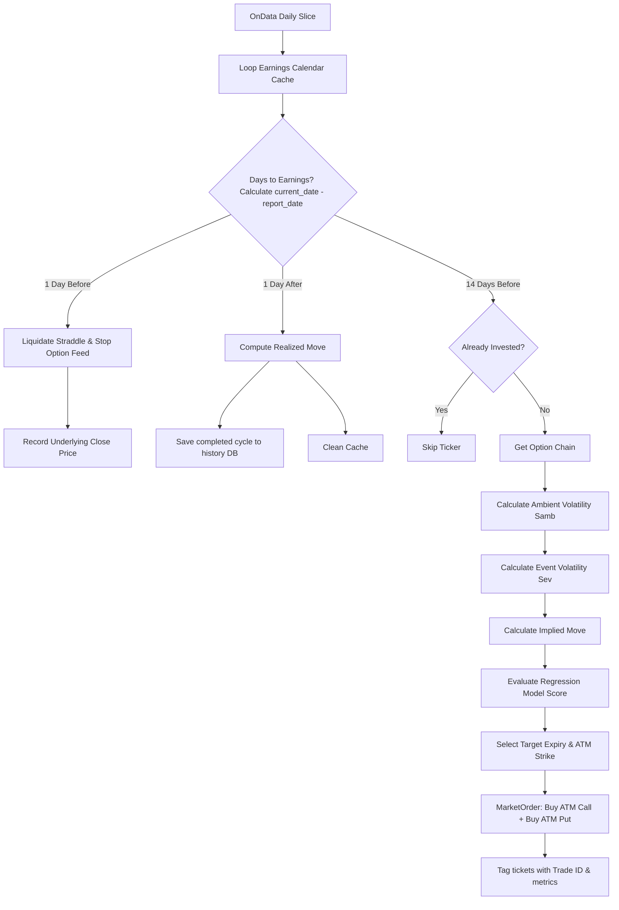

# Earnings Volatility Ramp (EVR) - Strategy Logic Flow

This document details every logical branch, parameter constraint, mathematical solver, and predictive model rule implemented within the **Earnings Volatility Ramp (EVR)** option strategy ([main.py](file:///c:/Users/bryan/QuantConnectProjectGit/5_EarningsVolatilityRamp/main.py)).

---

## 1. Strategy Overview

The strategy exploits the **Implied Volatility (IV) Run-up** that occurs in the weeks leading up to a company's earnings announcement. 

### Position Mechanics: ATM Straddle

*   **Long Straddle (Call + Put)**: Buys an At-The-Money (ATM) Call and an ATM Put option expiring shortly *after* the earnings date.
*   **Entry Timing**: Opened exactly **14 days prior** to the earnings announcement, when the volatility ramp-up typically begins.
*   **Exit Timing**: Liquidated exactly **1 day prior** to the earnings announcement. This captures the increase in option prices driven by rising IV without exposing the portfolio to the actual earnings announcement gap risk (avoiding the subsequent IV Crush).
*   **Regression Filtering**: Uses a historical regression model based on previous cycle moves to score candidates.
*   **Net Bias**: Net-debit entry, long Vega, negative Theta, and Delta-neutral.

---

## 2. Detailed Execution Flowchart

---

## 3. Step-by-Step Logic Details

### Step 0: Universe Selection (`coarse_universe_selection` & `earnings_universe_selection`)

1.  **Coarse Selection (Liquid Universe)**:
    -   Filters US equities daily.
    -   **Price Filter**: Price > $10.
    -   **Liquidity Filter**: Daily dollar volume > $10,000,000.
    -   **Fundamentals**: Requires fundamental reports.
    -   **State Cache**: Saves selected symbols into `self.liquid_symbols`.
2.  **Earnings Calendar Selection**:
    -   Uses the `EODHDUpcomingEarnings` dataset to scan coarse stocks.
    -   **Target Window Filter**: Filters for stocks with announcements scheduled between 14 and 22 days out:
        $$
        14 \le (\text{Report Date} - \text{Current Date}) \le 22
        $$
    -   **Optionability**: Confirms active option contracts exist via `GetOptionContractList`.
    -   Adds valid symbols to `self.earnings_calendar` map with their report date.

### Step 1: Volatility Indicator Calculations

At entry (14 days before earnings):

1.  **Ambient Volatility ($V_{\text{ambient}}$)**: Annualized background volatility excluding the event.
    -   *Method 1*: ATM implied volatility of an option expiring 1 to 5 days *before* the earnings date.
    -   *Method 2 (Proxy)*: Forward volatility calculated across the first two expiries after earnings:
        $$
        V_{\text{ambient}} = \sqrt{\frac{\sigma_2^2 \cdot T_2 - \sigma_1^2 \cdot T_1}{T_2 - T_1}}
        $$
2.  **Event Volatility ($V_{\text{event}}$)**: Isolated volatility of the announcement event day. Solved using target post-earnings ATM IV ($\sigma_{\text{total}}$) and ambient vol:
    $$
    V_{\text{event}} = \sqrt{\sigma_{\text{total}}^2 \cdot T - V_{\text{ambient}}^2 \cdot (T - 1)}
    $$
3.  **Implied Move ($IV_{\text{move}}$)**: The expected absolute percentage move implied by the event volatility:
    $$
    IV_{\text{move}} = V_{\text{event}} \times \sqrt{\frac{1}{365}} \times \sqrt{\frac{2}{\pi}}
    $$

### Step 2: Regression Score Filtering (`calculate_model_score`)

Computes a predictive regression score using historical cycles stored in `self.history_db`:
1.  **Signals**:
    -   $S_1$: $\frac{\text{Current Implied Move}}{\text{Previous Cycle Implied Move}}$
    -   $S_2$: $\text{Current Implied Move} - \text{Previous Cycle Realized Move}$
    -   $S_3$: $\text{Current Implied Move} - \text{Historical Avg Realized Move}$
    -   $S_4$: $\frac{\text{Current Implied Move}}{\text{Historical Avg Implied Move}}$
2.  **Model Calculation**:
    Retrieves year-specific coefficients from `model_weights.json` (falling back to default):
    $$
    \text{Score} = C + w_1 S_1 + w_2 S_2 + w_3 S_3 + w_4 S_4
    $$

### Step 3: Straddle Execution & Tick Tagging

1.  **Contract Resolution**:
    -   Finds the first option expiration date falling after the earnings announcement.
    -   Identifies the ATM strike price closest to the underlying asset close price.
2.  **Order Execution**:
    -   Submits market orders for the ATM Call and Put contracts:
        -   `MarketOrder(CallContract.Symbol, 1)`
        -   `MarketOrder(PutContract.Symbol, 1)`
    -   Tags order tickets with a JSON string containing the unique `Trade ID`, `Regression Score`, and the calculated metrics ($V_{\text{ambient}}$, $V_{\text{event}}$, $IV_{\text{move}}$).

### Step 4: Position Liquidation & Analytics

1.  **Exit Day -1**: 1 day before earnings, liquidates all options and stock holdings for the symbol, removing option feed subscriptions. Records the close price before the announcement.
2.  **Post-Earnings Day +1**: 1 day after earnings, fetches the new stock close price. Computes the actual absolute realized move of the stock:
    $$
    \text{Realized Move} = |\text{Post-Earnings Price} - \text{Pre-Earnings Price}|
    $$
    Saves the completed cycle to the symbol's historical database for future signal calculations.
