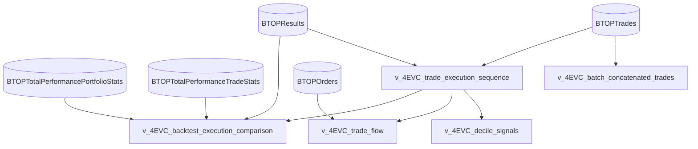

# Deep Dive (DD): BigQuery Data Warehouse Entity-Relationship Diagram (ERD)

## Architectural Design Overview & Deep Dive (DD) Rationale

This document presents the complete **Entity-Relationship Diagram (ERD)** for the BigQuery Data Warehouse (`bav-personal-cloud.develop`). 

The schema is architected around a **Star-Snowflake Hybrid Model** optimized for high-frequency quantitative strategy research, multi-year backtest analytics, trade factor attribution, and Looker Studio dashboards.

### Core Architectural Entities & Primary Key (PK) / Foreign Key (FK) Integrity

1. **`BTOPResults` (Central Dimension Entity)**:
   - **Primary Key**: `backtestId` (32-character hexadecimal string).
   - Serves as the single source of truth for backtest run metadata (name, project ID, execution timestamps, status, runtime errors). All granular performance tables, trade logs, and parameter dictionaries join directly to `BTOPResults.backtestId`.

2. **`BTOPTrades` (Fact Table)**:
   - **Primary Key**: `pk` (Composite formatted as `<backtest_run_id>_<underlying>_<sequence_id>`).
   - **Foreign Keys**: 
     - `backtest_run_id` $\rightarrow$ `BTOPResults.backtestId` (1:N)
     - `batch_id` $\rightarrow$ `BTOPBatchChunks.batch_id` (1:N)
   - Stores trade execution events, contract parameters, exit reasons, and pre-computed quantitative factor signals (`vol_ratio`, `slope`, `ivrv_ratio`).

3. **`BTOPBatchChunks` (Batch Orchestration Entity)**:
   - **Primary Key**: (`batch_id`, `chunk_index`).
   - **Foreign Key**: `backtest_id` $\rightarrow$ `BTOPResults.backtestId` (1:1 per chunk).
   - Tracks multi-year chunked executions (e.g. 2022, 2023, 2024), allowing serverless pollers ([qc_batch_poller.py](file:///c:/Users/bryan/QuantConnectProjectGit/Scripts/BigQuery/qc_batch_poller.py)) to ingest and stitch annual runs into continuous equity curves.

4. **Performance & Statistics Tables (1:1 & 1:N Child Tables)**:
   - `BTOPTotalPerformancePortfolioStats` & `BTOPTotalPerformanceTradeStats` (1:1 with `BTOPResults`).
   - `BTOPTotalPerformanceClosedTrades`, `BTOPRollingWindowPortfolioStats`, `BTOPRollingWindowTradeStats`, `BTOPCharts`, `BTOPOrders` (1:N with `BTOPResults`).

---

## Graphical Entity-Relationship Diagram (Mermaid ERD)

```mermaid
erDiagram

    BTOPResults ||--o{ BTOPTrades : "1 : N (backtestId = backtest_run_id)"
    BTOPResults ||--o{ BTOPOrders : "1 : N (backtestId = backtestId)"
    BTOPResults ||--|| BTOPTotalPerformancePortfolioStats : "1 : 1 (backtestId = backtestId)"
    BTOPResults ||--|| BTOPTotalPerformanceTradeStats : "1 : 1 (backtestId = backtestId)"
    BTOPResults ||--o{ BTOPTotalPerformanceClosedTrades : "1 : N (backtestId = backtestId)"
    BTOPResults ||--o{ BTOPRollingWindowPortfolioStats : "1 : N (backtestId = backtestId)"
    BTOPResults ||--o{ BTOPRollingWindowTradeStats : "1 : N (backtestId = backtestId)"
    BTOPResults ||--|| BTOPParameterSet : "1 : 1 (backtestId = backtestId)"
    BTOPResults ||--|| BTOPResearchGuide : "1 : 1 (backtestId = backtestId)"
    BTOPResults ||--|| BTOPRuntimeStatistics : "1 : 1 (backtestId = backtestId)"
    BTOPResults ||--o{ BTOPCharts : "1 : N (backtestId = backtestId)"
    
    BTOPBatchChunks ||--o| BTOPResults : "1 : 1 (backtest_id = backtestId)"
    BTOPBatchChunks ||--o{ BTOPTrades : "1 : N (batch_id = batch_id)"

    BTOPResults {
        string backtestId PK "Primary Key (32-char hex)"
        string name "Backtest name"
        int64 projectId "QC Project ID (22447448)"
        timestamp created "Submission timestamp"
        timestamp backtestStart "Simulation start"
        timestamp backtestEnd "Simulation end"
        boolean completed "Completion status"
        float64 progress "Progress decimal"
    }

    BTOPTrades {
        string pk PK "Composite Primary Key"
        string backtest_run_id FK "References BTOPResults"
        string batch_id FK "References BTOPBatchChunks"
        string algo_code "Strategy code (4EVC)"
        timestamp timestamp "Trade UTC time"
        string underlying "Ticker symbol"
        string action "OPEN or CLOSE"
        float64 vol_ratio "Vol Ratio factor"
        float64 slope "Slope factor"
        float64 ivrv_ratio "IV/RV Ratio factor"
        float64 pnl "Dollar PnL"
        string exit_reason "Normalized exit reason"
    }

    BTOPBatchChunks {
        string batch_id PK "Batch run identifier"
        int64 chunk_index PK "Chunk sequence number"
        string backtest_id FK "References BTOPResults"
        string algo_code "Strategy code"
        date start_date "Chunk start date"
        date end_date "Chunk end date"
        string status "PENDING, RUNNING, COMPLETED"
    }

    BTOPOrders {
        string backtestId FK "References BTOPResults"
        int64 id "Order ID"
        timestamp time "Order timestamp"
        float64 price "Fill price"
        float64 quantity "Order quantity"
        int64 type "Order type enum"
        int64 status "Order status enum"
    }

    BTOPTotalPerformancePortfolioStats {
        string portfolioStatId PK "Primary Key"
        string backtestId FK "References BTOPResults"
        float64 compoundingAnnualReturn "CAGR"
        float64 drawdown "Max Drawdown"
        float64 totalNetProfit "Net Profit"
        float64 sharpeRatio "Sharpe Ratio"
        float64 sortinoRatio "Sortino Ratio"
        float64 winRate "Win Rate"
    }

    BTOPTotalPerformanceTradeStats {
        string tradeStatId PK "Primary Key"
        string backtestId FK "References BTOPResults"
        int64 totalNumberOfTrades "Total trades count"
        int64 numberOfWinningTrades "Winning trades count"
        int64 numberOfLosingTrades "Losing trades count"
        float64 profitFactor "Profit factor"
        float64 totalFees "Total commission fees"
    }

    BTOPTotalPerformanceClosedTrades {
        string tradeId PK "Trade ID"
        string backtestId FK "References BTOPResults"
        string symbol "Asset ticker"
        timestamp entryTime "Entry time"
        timestamp exitTime "Exit time"
        float64 profitLoss "Dollar PnL"
        boolean isWin "Win flag"
    }

    BTOPRollingWindowPortfolioStats {
        string portfolioStatId PK "Primary Key"
        string backtestId FK "References BTOPResults"
        string rollingWindowId "Window label (e.g. 12M)"
        float64 compoundingAnnualReturn "Rolling CAGR"
        float64 drawdown "Rolling Max Drawdown"
        float64 sharpeRatio "Rolling Sharpe Ratio"
    }
```

---

## Analytical Views Layer (Looker Data Sources)



1. **`v_4EVC_backtest_execution_comparison`**: Primary data source for Looker scorecards and comparison matrices. Joins `BTOPResults`, `BTOPTotalPerformancePortfolioStats`, `BTOPTotalPerformanceTradeStats`, and `v_4EVC_trade_execution_sequence` filtered by `WHERE r.name LIKE '%4EVC%'`.
2. **`v_4EVC_trade_execution_sequence`**: Sequences trades 1..N per backtest and computes cumulative running PnL and peak-to-trough drawdowns.
3. **`v_4EVC_trade_flow`**: Combines open/close trade lifecycle records with raw order fills for Sankey diagrams.
4. **`v_4EVC_decile_signals`**: Computes decile factor buckets for Volatility Ratio, Slope, and IV/RV Ratio.
5. **`v_4EVC_batch_concatenated_trades`**: Concatenates multi-period batch chunks into a continuous multi-year equity curve.

---

## Machine-Readable JSON ERD Specification

The structured JSON representation of the ERD is also saved locally to [bigquery_schema_erd.json](file:///c:/Users/bryan/QuantConnectProjectGit/Resources/bigquery_schema_erd.json):

```json
{
  "$schema": "https://json-schema.org/draft/2020-12/schema",
  "title": "QuantConnect BigQuery Data Warehouse ERD",
  "project_id": "bav-personal-cloud",
  "dataset_id": "develop",
  "entities": {
    "BTOPResults": {
      "type": "TABLE",
      "primary_key": ["backtestId"],
      "fields": {
        "backtestId": {"type": "STRING", "mode": "REQUIRED", "description": "Unique 32-character hexadecimal backtest run identifier (Primary Key)."},
        "name": {"type": "STRING", "mode": "NULLABLE", "description": "Human-readable name of the backtest execution."},
        "projectId": {"type": "INTEGER", "mode": "NULLABLE", "description": "QuantConnect Project ID (22447448 for 4EVC)."},
        "created": {"type": "TIMESTAMP", "mode": "NULLABLE", "description": "UTC timestamp when backtest was created/launched."}
      }
    },
    "BTOPTrades": {
      "type": "TABLE",
      "primary_key": ["pk"],
      "foreign_keys": [
        {"column": "backtest_run_id", "references": {"table": "BTOPResults", "column": "backtestId"}, "relationship": "MANY_TO_ONE"},
        {"column": "batch_id", "references": {"table": "BTOPBatchChunks", "column": "batch_id"}, "relationship": "MANY_TO_ONE"}
      ],
      "fields": {
        "pk": {"type": "STRING", "mode": "REQUIRED", "description": "Composite Primary Key <backtest_run_id>_<underlying>_<sequence_id>."},
        "backtest_run_id": {"type": "STRING", "mode": "REQUIRED", "description": "Foreign Key referencing BTOPResults.backtestId."},
        "algo_code": {"type": "STRING", "mode": "REQUIRED", "description": "Strategy code (4EVC)."},
        "vol_ratio": {"type": "FLOAT", "mode": "NULLABLE", "description": "Front-to-back IV ratio at entry."},
        "slope": {"type": "FLOAT", "mode": "NULLABLE", "description": "Implied volatility term structure slope at entry."},
        "ivrv_ratio": {"type": "FLOAT", "mode": "NULLABLE", "description": "IV to Realized Volatility ratio at entry."}
      }
    },
    "BTOPBatchChunks": {
      "type": "TABLE",
      "primary_key": ["batch_id", "chunk_index"],
      "foreign_keys": [
        {"column": "backtest_id", "references": {"table": "BTOPResults", "column": "backtestId"}, "relationship": "ONE_TO_ONE"}
      ]
    }
  }
}
```
